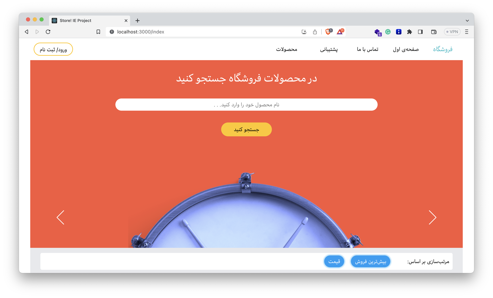
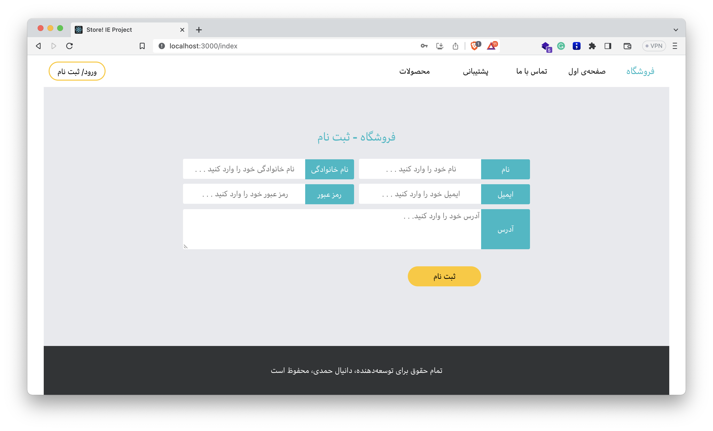
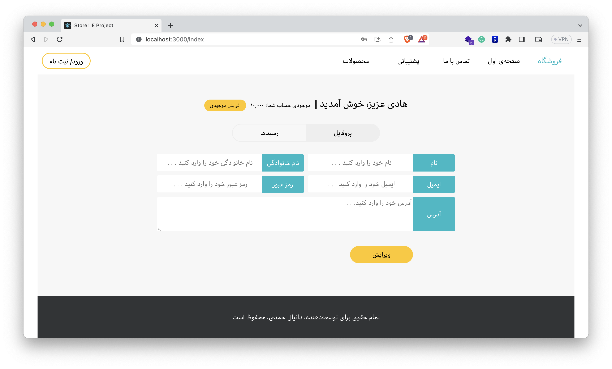

# E-Commerce Website

This is an e-commerce website built with a React frontend and Golang backend. Users can browse products, add them to a
cart, and purchase items. The website was developed as the final project of Internet Engineering course, Amirkabir
University of Technology.

The complete project description is available in 3
parts ([html/css](docs/instructions1_html_css.pdf), [js](docs/instructions2_js.pdf), [backend](docs/instructions3_backend.pdf))
at the `docs`
folder, in Persian.

## Overview

- Users can
    - Browse products by category
    - Add/remove products to cart
    - Purchase products via checkout
    - Register and login
- Admins can
    - manage products, orders, and users
- Backend Tech Stack
    - Golang
    - gorm to use PostgreSQL
    - JWT for authentication

## Running Locally

### Backend

From the `backend` directory:

1. Run `go mod tidy` to install dependencies
2. Run `go run main.go` to start the API server on port 8000

### Frontend

From the `frontend` directory:

1. Run `npm install` to install dependencies
2. Run `npm start` to start the dev server on port 3000

## Demo

| Title         | Screenshot                    |
|---------------|-------------------------------|
| Home Page     |      |  
| Register Page |  |
| Profile Page  |   |

## API Reference

### CategoryController

| Endpoint | HTTP Method | Description                 |
|----------|-------------|-----------------------------|
| `/`      | GET         | Get all categories          |
| `/`      | POST        | Create a new category       |
| `/:id/`  | PUT         | Update an existing category |
| `/:id/`  | DELETE      | Delete an existing category |

### OrderController

| Endpoint          | HTTP Method | Description         |
|-------------------|-------------|---------------------|
| `/`               | POST        | Order a product     |
| `/`               | GET         | Get orders list     |
| `/:code/`         | GET         | Get an order        |
| `/:code/:status/` | PUT         | Update order status |

### ProductController

| Endpoint | HTTP Method | Description          |
|----------|-------------|----------------------|
| `/`      | GET         | Get products         |
| `/:id/`  | GET         | Get a product        |
| `/file/` | POST        | Upload an image      |
| `/`      | POST        | Create a new product |
| `/:id/`  | PUT         | Update a product     |

### UserController

| Endpoint              | HTTP Method | Description              |
|-----------------------|-------------|--------------------------|
| `/login`              | POST        | Log user into the system |
| `/register`           | POST        | Register a new user      |
| `/me/`                | GET         | Get current user details |
| `/:id`                | GET         | Get a user's details     |
| `/`                   | GET         | Get users                |
| `/me/`                | PUT         | Update current user      |
| `/me/credit/:credit/` | PUT         | Change user's credit     |

## To Do

Note that the backend and frontend are not connect to each other. And each can be run as a stand-alone projects. Though
unprobable, if anyone is intersted in completing the project by glueing the parts together, PR's are welcome and
appreciated!

- [ ] Routing in Frontend
- [ ] Connecting the Frontend to the Backend

## Contributors

- [Danial Hamdi](https://github.com/da-nial)
- [Alex Gholamian](https://github.com/alxgh) (I sincerely thank him for his help with the backend of the project.)

## Course Information

- **Course**: Information Security
- **University**: Amirkabir University of Technology
- **Semester**: Fall 2022

Let me know if you have any questions!

